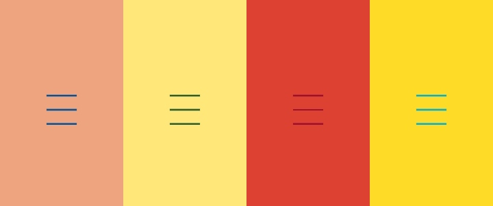

# Animated Burger

Animated burger with different styles and animations. It uses HTML, CSS, and JavaScript to create an interactive experience.



- [Demo](https://johndev19.github.io/Animated-Burger/)

## Table of Contents

- [Introduction](#animated-burgers)
- [Features](#features)
- [How to Use](#how-to-use)
- [Contributing](#contributing)
- [License](#license)

## Features

- Three different animated burger styles.
- Interactive transitions between idle, activating, and activated states.
- Responsive design for various screen sizes.

## How to Use

1. Clone the repository:

   ```bash
   git clone https://johndev19.github/Animated-Burger/
   ```

2. Open the `index.html` file in your preferred web browser.

3. Explore the animated burger icons and click to see the interactive transitions.

## Contributing

If you'd like to contribute to this project, please follow these steps:

1. Fork the repository.
2. Create a new branch for your feature: `git checkout -b feature-name`.
3. Make changes and commit: `git commit -m 'Add some feature'`.
4. Push to the branch: `git push origin feature-name`.
5. Submit a pull request.

## License

This project is licensed under the [MIT License](LICENSE).
